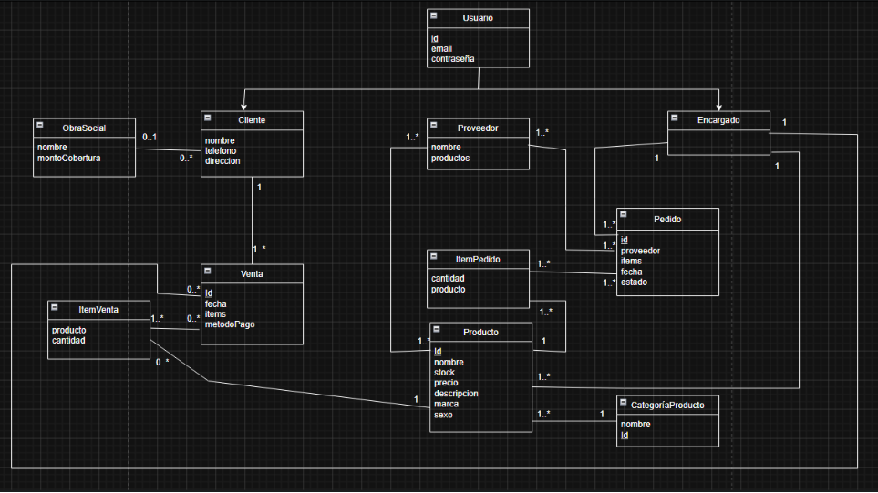

# Propuesta TP DSW

## Grupo

### Integrantes

- 53755 - Pierabella, Franco
- 54356 - Cristofoli, Fabricio Damian
- 53800 - Guarc, Joaquin Ismael
- 53831 - Melano, Iara

### Repositorios

- [frontend app](http://hyperlinkToGihubOrGitlab)
- [backend app](http://hyperlinkToGihubOrGitlab)

 

*Nota*: si utiliza un monorepo indicar un solo link con fullstack app.

## Tema

### Descripción

El sistema consiste en una aplicación web para la gestión y comercialización de productos de una farmacia.

La aplicación permitirá a los clientes consultar el catálogo de productos disponibles, visualizar información detallada, consultar categorías, agregar productos a un carrito y realizar compras mediante diferentes medios de pago.

Por otro lado, contará con funcionalidades destinadas a la administración de la farmacia, permitiendo gestionar productos, categorías, clientes, ventas y stock.

El sistema estará compuesto por un backend encargado de la lógica de negocio y persistencia de datos, y un frontend web destinado a la interacción con clientes y administradores.

### Tecnologías

El sistema será desarrollado utilizando:

- **Frontend:** React + TypeScript.
- **Backend:** Node.js + Express + TypeScript.
- **Base de datos:** MySQL.
- **ORM:** MikroORM.
- **Comunicación:** API REST.
- **Control de versiones:** Git.

### Modelo

---

## Alcance Funcional

### Alcance Mínimo

| Req | Detalle |
| :- | :- |
| CRUD simple | 1. CRUD CategoríaProducto |
| CRUD dependiente | 1. CRUD Producto {depende de} CRUD CategoríaProducto   2. CRUD Venta {depende de} CRUD Cliente   3. CRUD ItemVenta {depende de} CRUD Venta y Producto |
| Listado + detalle | 1. Listado de productos, con posibilidad de filtrado por categoría, mostrando nombre, precio y stock. El detalle muestra la información completa del producto.   2. Listado de ventas filtradas por fecha o rango de fechas, mostrando fecha de venta, productos vendidos, cantidades, cliente y precio final. El detalle muestra la información completa de la venta. |
| Gestión de usuarios | 1. Registro e inicio de sesión de clientes.   2. Gestión diferenciada entre clientes y administradores. |
| CUU/Epic | 1. Registrar una venta.   2. Realizar una compra como cliente.   3. Consultar disponibilidad de productos. |

### Adicionales para Aprobación

| Req | Detalle |
| :- | :- |
| CRUD | 1. CRUD Customer   2. CRUD Product   3. CRUD Sale   4. CRUD SaleItem   5. CRUD CategoryProduct   6. CRUD Manager |
| Gestión de stock | 1. Consultar stock disponible.   2. Actualizar stock luego de una venta.   3. Controlar productos sin stock.   4. Informar productos con stock bajo al administrador. |
| Carrito | 1. Agregar productos al carrito.   2. Modificar cantidades.   3. Eliminar productos.   4. Calcular subtotales y total de compra. |
| Ventas | 1. Registrar los productos vendidos y sus cantidades.   2. Asociar la venta con un cliente.   3. Registrar el método de pago.   4. Gestionar el estado de la venta. |
| Métodos de pago | La venta podrá utilizar alguno de los siguientes medios de pago:   - CASH   - TRANSFER   - CREDIT_CARD   - DEBIT_CARD |
| Estados de venta | Las ventas podrán encontrarse en alguno de los siguientes estados:   - PENDING   - CONFIRMED   - CANCELLED |
| Administración | 1. Panel de administración.   2. Gestión de productos y categorías.   3. Gestión de clientes y ventas.   4. Control y actualización del stock. |
| Productos destacados | El administrador podrá determinar qué productos se muestran como "Productos destacados" en la página principal mediante una propiedad `isFeatured`. |
| CUU/Epic | 1. Realizar consulta siendo cliente a administrador.   2. Informar faltantes de stock a administrador.   3. Actualizar stock después de una venta realizada.   4. Realizar una compra mediante el carrito. |

---

## Alcance Adicional Voluntario

*Nota*: El Alcance Adicional Voluntario es opcional, pero ayuda a que la funcionalidad del sistema esté completa y será considerado en la nota en función de su complejidad y esfuerzo.

| Req | Detalle |
| :- | :- |
| Listados | 1. Ventas realizadas por fecha.   2. Productos con stock bajo.   3. Productos más vendidos.   4. Productos destacados. |
| Filtros y búsqueda | 1. Búsqueda de productos por nombre.   2. Filtrado por categoría.   3. Filtrado por disponibilidad de stock. |
