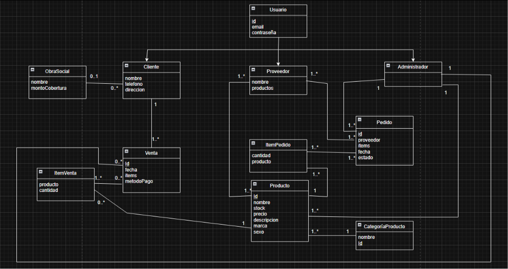

# Propuesta TP DSW

## Grupo
### Integrantes
* 53755 - Pierabella, Franco
* 54356 - Cristofoli, Fabricio Damian
* 53800 - Guarc, Joaquin Ismael
* 53831 - Melano, Iara

### Repositorios
* [frontend app](http://hyperlinkToGihubOrGitlab)
* [backend app](http://hyperlinkToGihubOrGitlab)
*Nota*: si utiliza un monorepo indicar un solo link con fullstack app.

## Tema
### Descripción
El sistema consiste en una aplicación web para la gestión de una farmacia, que permitirá administrar productos, controlar el stock de medicamentos, registrar ventas a clientes y facilitarles la consulta de disponibilidad de productos.

### Modelo

## Alcance Funcional 

### Alcance Mínimo

Regularidad:
|Req|Detalle|
|:-|:-|
|CRUD simple|1. CRUD ObraSocial  2. CRUD CategoriaProducto 3. CRUD Proveedor|
|CRUD dependiente|1. CRUD Cliente {depende de} CRUD ObraSocial   2. CRUD Producto {depende de} CRUD categoriaProducto |
|Listado + detalle| 1. Listado de productos filtrado por categoria, muestra nombre,precio y Stock => detalle: Muestra informacion de producto   2. Listado de ventas filtradas por fecha o rango de fechas, muestra fechaVenta, ProductoVendido y cantidad, nombre del cliente y precioFinal => detalle muestra datos completos de la venta realizada en tal fecha o rango de fechas|
|CUU/Epic|1. Registrar una venta  2. Generar Pedido a proveedor|

Adicionales para Aprobación
|Req|Detalle|
|:-|:-|
|CRUD |1. CRUD Cliente  2. CRUD Producto  3. CRUD Proveedor 4. CRUD Venta  5. CRUD ItemVenta 6. CRUD Categoria  7. CRUD Farmaceutico|
|CUU/Epic|1. Registrar una venta 2. Iniciar sesion como Cliente  3. Actualizar Stock despues de venta realizada. |

### Alcance Adicional Voluntario

*Nota*: El Alcance Adicional Voluntario es opcional, pero ayuda a que la funcionalidad del sistema esté completa y será considerado en la nota en función de su complejidad y esfuerzo.

|Req|Detalle|
|:-|:-|
|Listados |1. Ventas realizadas por fecha  2.Productos con Stock bajo|
|CUU/Epic| |
|Otros||

